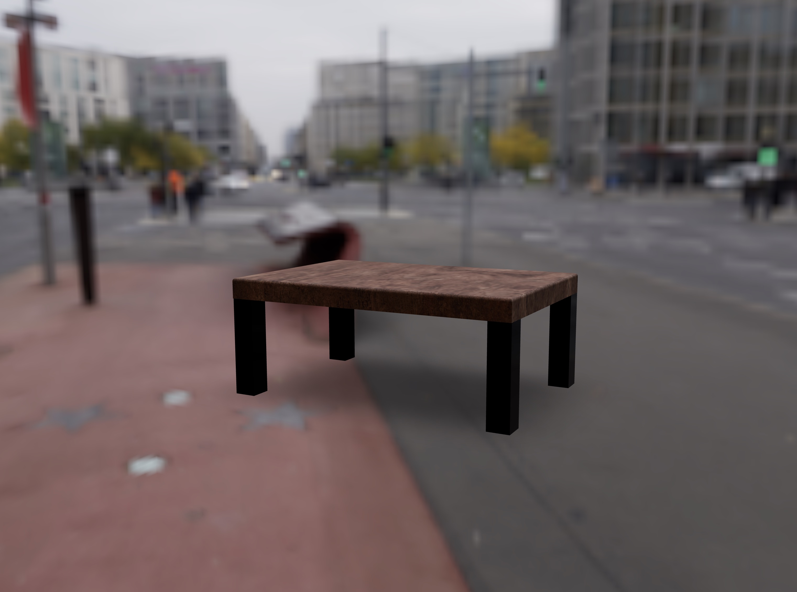
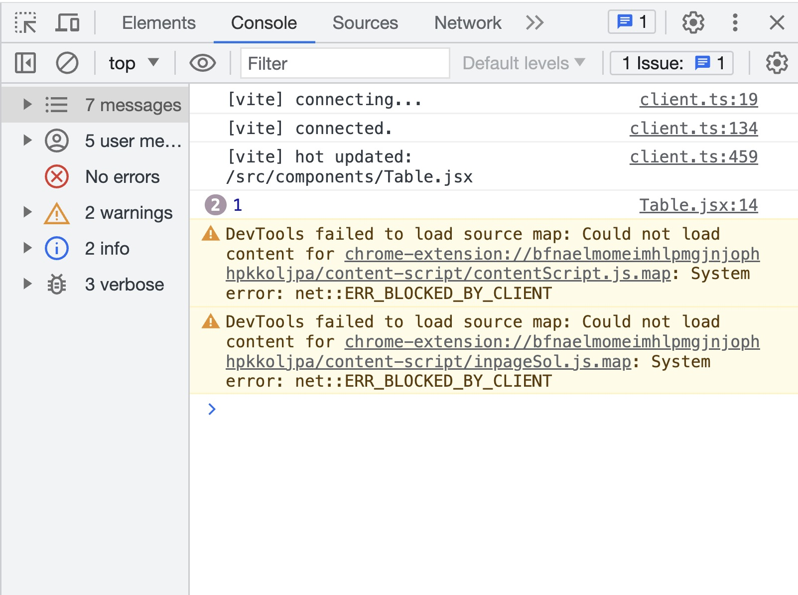
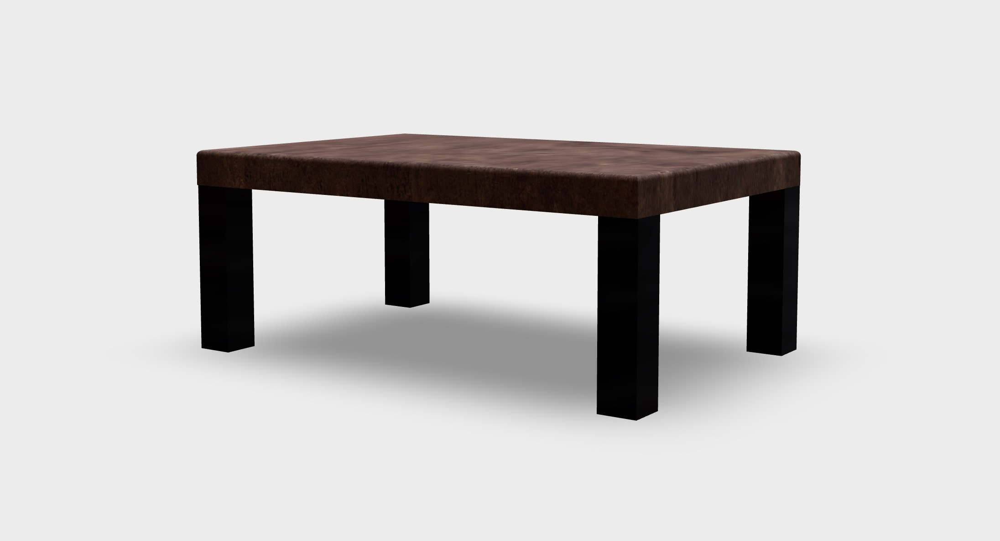
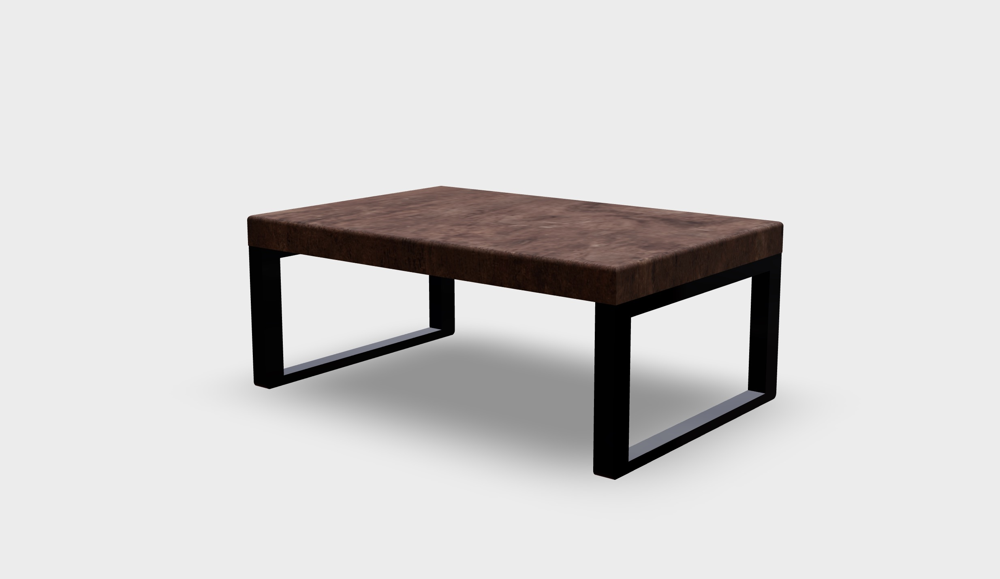

# Getting started with React Three Fiber

Hello, welcome to this meetup! Let's build together a simple 3D table configurator using React Three Fiber!

[🇯🇵 日本語の README はこちら](./README.ja.md)

Let's use the `#Tokyo3DWeb` hashtag on Twitter to share our progress and photos of the event! You can also mention me [@wawasensei](https://twitter.com/wawasensei).


_Grab the repo URL by scanning the QRCode above or type it manually:
`https://github.com/wass08/meetup-r3f-workshop`_

The final source code is also [available here](https://github.com/wass08/meetup-r3f-workshop-final) _(perfect if you only want to work on the HTML/CSS interface)_

## Project setup

To run this starter project simply run:

```bash
yarn
```

To install all the dependencies and then:

```bash
yarn dev
```

To start the development server.


_You should see a cube in the middle of the screen._

## Ultra quick introduction to React Three Fiber

The following code in the `src/components/Experience.jsx` is responsible for rendering the cube:

```jsx
<mesh>
  <boxGeometry />
  <meshStandardMaterial color="white" />
</mesh>
```

In _3D_ world, a mesh is an object that is made up of a **Geometry** and a **Material**.

- A **Geometry** is the shape of the object, in this case a cube. It can be a sphere, a plane, a cylinder, etc.
- A **Material** is like clothing for the object and it defines how the object looks like (color, metallic, roughness, etc.) in this case a simple material that shows a **white color**.

### Axes, Position, rotation and scale

In a 3D space, there are three axes: `x`, `y`, and `z`. Each axis is a line that extends infinitely in both directions.


With **Three.js** the axes are defined as follows:

- `x`: points to the right
- `y`: points up
- `z`: points towards the viewer

We can move the cube around by changing its position. It takes an array of three values: `[x, y, z]`:

```jsx
<mesh position={[5, 0, 0]}>
  <boxGeometry />
  <meshStandardMaterial color="white" />
</mesh>
```

We can also rotate the cube by changing its rotation.

The `rotation` values are in radians. To convert degrees to radians, you can use the `THREE.MathUtils.degToRad()` method:

```jsx
import { OrbitControls } from "@react-three/drei";

import * as THREE from "three";

export const Experience = () => {
  return (
    <>
      <OrbitControls />
      <mesh
        position={[1, 1, 0]}
        rotation={[0, THREE.MathUtils.degToRad(90), 0]}
      >
        <boxGeometry />
        <meshStandardMaterial color="white" />
      </mesh>
    </>
  );
};
```

We can also scale the cube by changing its scale:

```jsx
<mesh
  position={[1, 1, 0]}
  rotation={[0, THREE.MathUtils.degToRad(90), 0]}
  scale={[0.5, 0.5, 0.5]}
>
  <boxGeometry />
  <meshStandardMaterial color="white" />
</mesh>
```

This is the quickest possible introduction to React Three Fiber, don't worry if you're lost! We'll go through everything together through this hands-on workshop.

## Loading the table model

We'll use a **3D model of a table** that we'll load into our scene.

The `table.glb` model is available in the `public/models` folder.

Instead of coding it from scratch, we'll use a **command line tool** called [gltfjsx](https://github.com/pmndrs/gltfjsx) made by the creator of React Three Fiber.

It will generate the code for us to load the model into our scene:

```bash
npx gltfjsx public/models/table.glb -o src/components/Table.jsx -k -r public
```

We use `npx` to run `gltfjsx` without installing it globally.

The `-o` flag is used to specify the output file, in this case `src/components/Table.jsx`.

The `-k` flag is used to keep the name on the **meshes**.

The `-r` flag is used to specify the **root** folder of the model, in this case `public`.

The generated code looks like this:

```jsx
/*
Auto-generated by: https://github.com/pmndrs/gltfjsx
Command: npx gltfjsx@6.2.3 public/models/table.glb -o src/components/Table.jsx -k -r public
*/

import React, { useRef } from "react";
import { useGLTF } from "@react-three/drei";

export function Model(props) {
  const { nodes, materials } = useGLTF("/models/table.glb");
  return (
    <group {...props} dispose={null}>
      <mesh
        name="Plate"
        geometry={nodes.Plate.geometry}
        material={materials.Plate}
      />
      <mesh
        name="Legs01Left"
        geometry={nodes.Legs01Left.geometry}
        material={materials.Metal}
        position={[-1.5, 0, 0]}
      />
      <mesh
        name="Legs01Right"
        geometry={nodes.Legs01Right.geometry}
        material={materials.Metal}
        position={[1.5, 0, 0]}
      />
      <mesh
        name="Legs02Left"
        geometry={nodes.Legs02Left.geometry}
        material={materials.Metal}
        position={[-1.5, 0, 0]}
      />
      <mesh
        name="Legs02Right"
        geometry={nodes.Legs02Right.geometry}
        material={materials.Metal}
        position={[1.5, 0, 0]}
      />
      <mesh
        name="Legs03Left"
        geometry={nodes.Legs03Left.geometry}
        material={materials.Metal}
        position={[-1.5, 0, 0]}
      />
      <mesh
        name="Legs03Right"
        geometry={nodes.Legs03Right.geometry}
        material={materials.Metal}
        position={[1.5, 0, 0]}
      />
    </group>
  );
}

useGLTF.preload("/models/table.glb");
```

It uses the `useGLTF` hook from the [React Three Drei library](https://github.com/pmndrs/drei) to load the model.

And it assigns the `geometry`, `material`, and `position` to each **mesh** it found in the model.

We can now import the `Model` component in our `Experience` component. Let's replace our cube with the table:

```jsx
import { OrbitControls } from "@react-three/drei";
import { Model } from "./Table";

export const Experience = () => {
  return (
    <>
      <OrbitControls />
      <Model />
    </>
  );
};
```

https://github.com/wass08/meetup-r3f-workshop/assets/6551176/da5b711b-a7fd-44d6-8109-796858399a6e

We can see our **loaded table model** and **rotate around** it with the mouse.

_It currently displays the three different types of legs, we'll fix it when we'll add the **legs picker**._

## Adjust camera and lighting

Let's change the default camera position to have a better view of our table.

In `App.jsx`:

```jsx
<Canvas shadows camera={{ position: [0, 3, 8], fov: 42 }}>
```

The lighting is too dark, we can change the `Environment` preset to `city` to have a better lighting:

```jsx
<Environment preset="city" />
```

You can also add the `background` prop to the `Environment` to preview the applied preset:

```jsx
<Environment preset="city" background />
```



_Don't forget to remove it after..._

## Shadows

To make our configurator more realistic, we'll add **shadows** to our scene.

We will use the `ContactShadows` component from the [React Three Drei library](https://github.com/pmndrs/drei#contactshadows):

```jsx
import { ContactShadows, OrbitControls } from "@react-three/drei";
import { Model } from "./Table";

export const Experience = () => {
  return (
    <>
      <OrbitControls />
      <Model />
      <ContactShadows position={[0, -1, 0]} />
    </>
  );
};
```


It works, but the shadow is too harsh!

We can change the `blur` and `opacity` props to make it look better:

```jsx
<ContactShadows position={[0, -1, 0]} blur={3} opacity={0.42} />
```


Looks better!

## useConfigurator

We'll create a **custom hook** to get and set the **table configuration** from anywhere in our app.

We will use the [useContext](https://react.dev/reference/react/useContext) hook from React to create a **context** that will be available to all the components in our app and the [useState](https://react.dev/reference/react/useState) hook to store the **table configuration**.

Create a new folder `src/hooks` and a new file `useConfigurator.jsx`:

```jsx
import { createContext, useContext, useState } from "react";

export const ConfiguratorContext = createContext();

export const ConfiguratorProvider = ({ children }) => {
  const [legs, setLegs] = useState(1);

  return (
    <ConfiguratorContext.Provider value={{ legs, setLegs }}>
      {children}
    </ConfiguratorContext.Provider>
  );
};

export const useConfigurator = () => {
  const context = useContext(ConfiguratorContext);
  if (context === undefined) {
    throw new Error(
      "useConfigurator must be used within a ConfiguratorProvider"
    );
  }
  return context;
};
```

We created a `ConfiguratorContext` with the `createContext` function, and a `ConfiguratorProvider` component that will wrap our app and make the **table configuration** available to all the components.

We also created a `useConfigurator` hook that will be used to get and set the **table configuration**.

We can now wrap our app with the `ConfiguratorProvider` component in `src/index.jsx`:

```jsx
import React from "react";
import ReactDOM from "react-dom/client";
import App from "./App";
import { ConfiguratorProvider } from "./hooks/useConfigurator";
import "./index.css";

ReactDOM.createRoot(document.getElementById("root")).render(
  <React.StrictMode>
    <ConfiguratorProvider>
      <App />
    </ConfiguratorProvider>
  </React.StrictMode>
);
```

Let's use the `useConfigurator` hook in our `Table` component to get the **table configuration**:

```jsx
import { useGLTF } from "@react-three/drei";
import React from "react";
import { useConfigurator } from "../hooks/useConfigurator";

export function Model(props) {
  const { nodes, materials } = useGLTF("/models/table.glb");
  const { legs } = useConfigurator();

  console.log(legs);

  return (
    <group {...props} dispose={null}>
      {/* ... */}
    </group>
  );
}
```



We can see in the console that the current selected **legs** are `1`.

We can now use the `legs` variable to display the correct **legs** in our `Model` component:

```jsx
/*
Auto-generated by: https://github.com/pmndrs/gltfjsx
Command: npx gltfjsx@6.2.3 public/models/table.glb -o src/components/Table.jsx -k -r public
*/

import { useGLTF } from "@react-three/drei";
import React from "react";
import { useConfigurator } from "../hooks/useConfigurator";

export function Model(props) {
  const { nodes, materials } = useGLTF("/models/table.glb");
  const { legs } = useConfigurator();

  return (
    <group {...props} dispose={null}>
      <mesh
        name="Plate"
        geometry={nodes.Plate.geometry}
        material={materials.Plate}
      />
      {legs === 1 && (
        <>
          <mesh
            name="Legs01Left"
            geometry={nodes.Legs01Left.geometry}
            material={materials.Metal}
            position={[-1.5, 0, 0]}
          />
          <mesh
            name="Legs01Right"
            geometry={nodes.Legs01Right.geometry}
            material={materials.Metal}
            position={[1.5, 0, 0]}
          />
        </>
      )}
      {legs === 2 && (
        <>
          <mesh
            name="Legs02Left"
            geometry={nodes.Legs02Left.geometry}
            material={materials.Metal}
            position={[-1.5, 0, 0]}
          />
          <mesh
            name="Legs02Right"
            geometry={nodes.Legs02Right.geometry}
            material={materials.Metal}
            position={[1.5, 0, 0]}
          />
        </>
      )}
      {legs === 3 && (
        <>
          <mesh
            name="Legs03Left"
            geometry={nodes.Legs03Left.geometry}
            material={materials.Metal}
            position={[-1.5, 0, 0]}
          />
          <mesh
            name="Legs03Right"
            geometry={nodes.Legs03Right.geometry}
            material={materials.Metal}
            position={[1.5, 0, 0]}
          />
        </>
      )}
    </group>
  );
}

useGLTF.preload("/models/table.glb");
```



Now our table only displays one set of legs.

We can update manually the `legs` variable in the `useConfigurator` hook to see the other sets of legs:

```jsx
const [legs, setLegs] = useState(2);
```



We have the second set of legs displayed!

## HTML UI

We'll create a **HTML UI** to display the **table configuration** and allow the user to change it.

I chose to use [Chakra UI](https://chakra-ui.com/getting-started) but you can use any **CSS Framework** you want or go with **plain CSS**.

Install Chakra UI:

```bash
yarn add @chakra-ui/react @emotion/react @emotion/styled framer-motion
```

Wrap the `App` component with the `ChakraProvider` component in `src/index.jsx`:

```jsx
import { ChakraProvider } from "@chakra-ui/react";
import React from "react";
import ReactDOM from "react-dom/client";
import App from "./App";
import { ConfiguratorProvider } from "./hooks/useConfigurator";
import "./index.css";

ReactDOM.createRoot(document.getElementById("root")).render(
  <React.StrictMode>
    <ChakraProvider>
      <ConfiguratorProvider>
        <App />
      </ConfiguratorProvider>
    </ChakraProvider>
  </React.StrictMode>
);
```

We can now create our `Interface` in the `src/components/Interface.jsx` file:

```jsx
import { Box, Radio, RadioGroup, Stack, Text } from "@chakra-ui/react";
import { useConfigurator } from "../hooks/useConfigurator";

export const Interface = () => {
  const { legs, setLegs } = useConfigurator();
  return (
    <Stack
      textColor={"white"}
      pos={"fixed"}
      top={8}
      right={8}
      minW={200}
      userSelect={"none"}
    >
      <Box
        backgroundColor={"blackAlpha.600"}
        paddingY={4}
        paddingX={8}
        rounded="2xl"
      >
        <Text fontSize={"2xl"} fontWeight={"bold"}>
          Legs
        </Text>
        <RadioGroup
          onChange={(value) => setLegs(parseInt(value))}
          value={"" + legs}
        >
          <Stack direction="column" spacing={4} mt={4}>
            <Radio value="1">First</Radio>
            <Radio value="2">Second</Radio>
            <Radio value="3">Third</Radio>
          </Stack>
        </RadioGroup>
      </Box>
    </Stack>
  );
};
```

The only interesting part here is the:

```jsx
const { legs, setLegs } = useConfigurator();
```

That allows us to get the **table configuration** and update it.

We also need to import the `Interface` component in the `src/App.jsx` file. We can put it anywhere outside the `Canvas` component. We will add it next to it:

```jsx
import { Environment } from "@react-three/drei";
import { Canvas } from "@react-three/fiber";
import { Experience } from "./components/Experience";
import { Interface } from "./components/Interface";

function App() {
  return (
    <>
      <Canvas shadows camera={{ position: [0, 3, 8], fov: 42 }}>
        <color attach="background" args={["#ececec"]} />
        <Experience />
        <Environment preset="city" />
      </Canvas>
      <Interface />
    </>
  );
}

export default App;
```

https://github.com/wass08/meetup-r3f-workshop/assets/6551176/9cbae865-c3bd-4977-8409-5ac3e0945ebf

We now have an **HTML UI** to display the **table configuration** and allow the user to change it.

## Table width

We'll now add a **slider** to allow the user to change the **table width**.

First, let's add a `tableWidth` variable in the `useConfigurator` hook:

```jsx
// ...

export const ConfiguratorProvider = ({ children }) => {
  const [legs, setLegs] = useState(1);
  const [tableWidth, setTableWidth] = useState(1);

  return (
    <ConfiguratorContext.Provider
      value={{ legs, setLegs, tableWidth, setTableWidth }}
    >
      {children}
    </ConfiguratorContext.Provider>
  );
};

// ...
```

In the `Interface` component, we can now add a `Slider` component:

```jsx
import {
  Box,
  Radio,
  RadioGroup,
  Slider,
  SliderFilledTrack,
  SliderThumb,
  SliderTrack,
  Stack,
  Text,
} from "@chakra-ui/react";
import { useConfigurator } from "../hooks/useConfigurator";

export const Interface = () => {
  const { legs, setLegs, tableWidth, setTableWidth } = useConfigurator();
  return (
    <Stack
      textColor={"white"}
      pos={"fixed"}
      top={8}
      right={8}
      minW={200}
      userSelect={"none"}
    >
      <Box
        backgroundColor={"blackAlpha.600"}
        paddingY={4}
        paddingX={8}
        rounded="2xl"
      >
        <Text fontSize={"2xl"} fontWeight={"bold"}>
          Table width
        </Text>
        <Slider
          value={tableWidth}
          onChange={setTableWidth}
          min={0.5}
          max={2}
          step={0.001}
        >
          <SliderTrack>
            <SliderFilledTrack />
          </SliderTrack>
          <SliderThumb />
        </Slider>
      </Box>
      <Box
        backgroundColor={"blackAlpha.600"}
        paddingY={4}
        paddingX={8}
        rounded="2xl"
      >
        <Text fontSize={"2xl"} fontWeight={"bold"}>
          Legs
        </Text>
        <RadioGroup
          onChange={(value) => setLegs(parseInt(value))}
          value={"" + legs}
        >
          <Stack direction="column" spacing={4} mt={4}>
            <Radio value="1">First</Radio>
            <Radio value="2">Second</Radio>
            <Radio value="3">Third</Radio>
          </Stack>
        </RadioGroup>
      </Box>
    </Stack>
  );
};
```

As the `tableWidth` will impact the **scale of the table**, we allow the slider to go from `0.5` to `2` with a `step` of `0.001`.

Now, in the `Table` component, we can use the `tableWidth` to scale the table plate and also position the table legs:

```jsx
/*
Auto-generated by: https://github.com/pmndrs/gltfjsx
Command: npx gltfjsx@6.2.3 public/models/table.glb -o src/components/Table.jsx -k -r public
*/

import { useGLTF } from "@react-three/drei";
import React from "react";
import { useConfigurator } from "../hooks/useConfigurator";

export function Model(props) {
  const { nodes, materials } = useGLTF("/models/table.glb");
  const { legs, tableWidth } = useConfigurator();

  return (
    <group {...props} dispose={null}>
      <mesh
        scale={[tableWidth, 1, 1]}
        name="Plate"
        geometry={nodes.Plate.geometry}
        material={materials.Plate}
      />
      {legs === 1 && (
        <>
          <mesh
            name="Legs01Left"
            geometry={nodes.Legs01Left.geometry}
            material={materials.Metal}
            position={[-1.5 * tableWidth, 0, 0]}
          />
          <mesh
            name="Legs01Right"
            geometry={nodes.Legs01Right.geometry}
            material={materials.Metal}
            position={[1.5 * tableWidth, 0, 0]}
          />
        </>
      )}
      {legs === 2 && (
        <>
          <mesh
            name="Legs02Left"
            geometry={nodes.Legs02Left.geometry}
            material={materials.Metal}
            position={[-1.5 * tableWidth, 0, 0]}
          />
          <mesh
            name="Legs02Right"
            geometry={nodes.Legs02Right.geometry}
            material={materials.Metal}
            position={[1.5 * tableWidth, 0, 0]}
          />
        </>
      )}
      {legs === 3 && (
        <>
          <mesh
            name="Legs03Left"
            geometry={nodes.Legs03Left.geometry}
            material={materials.Metal}
            position={[-1.5 * tableWidth, 0, 0]}
          />
          <mesh
            name="Legs03Right"
            geometry={nodes.Legs03Right.geometry}
            material={materials.Metal}
            position={[1.5 * tableWidth, 0, 0]}
          />
        </>
      )}
    </group>
  );
}

useGLTF.preload("/models/table.glb");
```

https://github.com/wass08/meetup-r3f-workshop/assets/6551176/486d764a-0daa-455d-8534-6bfba1fc2501

We can now change the **table width** and see the **table plate** and **legs** change accordingly! 🎉

## Legs color

We'll add a last option to allow the user to change the **legs color**.

First, let's add a `legsColor` variable in the `useConfigurator` hook:

```jsx
import { createContext, useContext, useState } from "react";

export const ConfiguratorContext = createContext();

export const ConfiguratorProvider = ({ children }) => {
  const [legs, setLegs] = useState(1);
  const [tableWidth, setTableWidth] = useState(1);
  const [legsColor, setLegsColor] = useState("black");

  return (
    <ConfiguratorContext.Provider
      value={{
        legs,
        setLegs,
        tableWidth,
        setTableWidth,
        legsColor,
        setLegsColor,
      }}
    >
      {children}
    </ConfiguratorContext.Provider>
  );
};

export const useConfigurator = () => {
  const context = useContext(ConfiguratorContext);
  if (context === undefined) {
    throw new Error(
      "useConfigurator must be used within a ConfiguratorProvider"
    );
  }
  return context;
};
```

Then, in our `Interface` let's add some controls to change the `legsColor`:

```jsx
import {
  Box,
  Radio,
  RadioGroup,
  Slider,
  SliderFilledTrack,
  SliderThumb,
  SliderTrack,
  Stack,
  Text,
} from "@chakra-ui/react";
import { useConfigurator } from "../hooks/useConfigurator";

export const Interface = () => {
  const { legs, setLegs, tableWidth, setTableWidth, legsColor, setLegsColor } =
    useConfigurator();
  return (
    <Stack
      textColor={"white"}
      pos={"fixed"}
      top={8}
      right={8}
      minW={200}
      userSelect={"none"}
    >
      <Box
        backgroundColor={"blackAlpha.600"}
        paddingY={4}
        paddingX={8}
        rounded="2xl"
      >
        <Text fontSize={"2xl"} fontWeight={"bold"}>
          Table width
        </Text>
        <Slider
          value={tableWidth}
          onChange={setTableWidth}
          min={0.5}
          max={2}
          step={0.001}
        >
          <SliderTrack>
            <SliderFilledTrack />
          </SliderTrack>
          <SliderThumb />
        </Slider>
      </Box>
      <Box
        backgroundColor={"blackAlpha.600"}
        paddingY={4}
        paddingX={8}
        rounded="2xl"
      >
        <Text fontSize={"2xl"} fontWeight={"bold"}>
          Legs
        </Text>
        <RadioGroup
          onChange={(value) => setLegs(parseInt(value))}
          value={"" + legs}
        >
          <Stack direction="column" spacing={4} mt={4}>
            <Radio value="1">First</Radio>
            <Radio value="2">Second</Radio>
            <Radio value="3">Third</Radio>
          </Stack>
        </RadioGroup>
      </Box>
      <Box
        backgroundColor={"blackAlpha.600"}
        paddingY={4}
        paddingX={8}
        rounded="2xl"
      >
        <Text fontSize={"2xl"} fontWeight={"bold"}>
          Legs color
        </Text>
        <RadioGroup onChange={setLegsColor} value={legsColor}>
          <Stack direction="column" spacing={4} mt={4}>
            <Radio value="black">Black</Radio>
            <Radio value="pink">Pink</Radio>
            <Radio value="yellow">Gold</Radio>
            <Radio value="green">Green</Radio>
          </Stack>
        </RadioGroup>
      </Box>
    </Stack>
  );
};
```

I used `CSS color names` but you can use `Hexadecimal` or `RGB` values as well.

Time to apply the color to the legs! 🎨

```jsx
//...
import { useGLTF } from "@react-three/drei";
import React, { useEffect } from "react";
import { useConfigurator } from "../hooks/useConfigurator";

export function Model(props) {
  const { nodes, materials } = useGLTF("/models/table.glb");
  const { legs, tableWidth, legsColor } = useConfigurator();

  useEffect(() => {
    materials.Metal.color.set(legsColor);
  }, [legsColor]);

  return (
    <group {...props} dispose={null}>
      {/*...*/}
    </group>
  );
}
// ...
```

`useEffect` is a React hook that allows us to run some code when a variable changes. In our case, we want to change the color of the legs when the `legsColor` variable changes.

The legs material is called `Metal` and we can change its color by using the `set` method on the `color` property.

https://github.com/wass08/meetup-r3f-workshop/assets/6551176/a560ed77-e4c1-4a61-a942-e4ce5a458adb

The color is now changing! 🎉

## Conclusion

We've now built a configurator that allows us to change the **table width**, the **legs** and the **legs color**!

Here are some ideas to **go further** on this project:

- Add **more options** to change the **table plate color**, the **table plate material**, the **legs material**, etc.
- **Save the table configuration** in the browser's local storage
- Add a button to **download a photo of the table**
- Make the **interface responsive**
- **Animate the camera** to show the table from different angles
- **Lerp the table width** to its new configuration instead of changing it instantly
- **Scale the table plate texture** to match the table width (and avoid stretching)

## Resources

- [React Three Fiber](https://docs.pmnd.rs/react-three-fiber/getting-started/introduction)
- [Drei Library](https://github.com/pmndrs/drei): Useful components for React Three Fiber
- [Wawa Sensei](https://www.youtube.com/%2540WawaSensei): an amazing YouTube channel about Three.js and React Three Fiber 🤭
